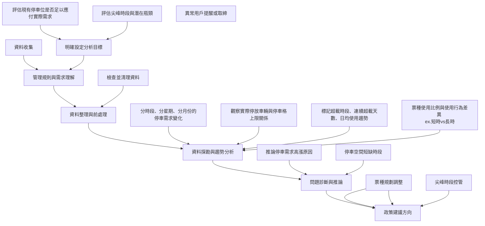

```mermaid
flowchart TD


A[資料收集]
B[管理規則與需求理解]
B_1[明確設定分析目標]
B_1_1[評估現有停車位是否足以應付實際需求]
B_1_2[評估尖峰時段與潛在瓶頸]
B_1_1 --> B_1
B_1_2 --> B_1
B_1 --> B

C[資料整理與前處理]
C_1[檢查並清理資料]
C_1 --> C

D[資料探勘與趨勢分析]
D_1[分時段、分星期、分月份的停車需求變化]
D_2[觀察實際停放車輛與停車格上限關係]
D_3[標記超載時段、連續超載天數、日均使用趨勢]
D_4[票種使用比例與使用行為差異 <br/>ex.短時vs長時]
D_1 --> D
D_2 --> D
D_3 --> D
D_4 --> D

E[問題診斷與推論]
E_1[推論停車需求高漲原因]
E_2[停車空間短缺時段]

E_1 --> E
E_2 --> E


F[政策建議方向]
F_1[票種規劃調整]
F_2[尖峰時段控管]
F_3[異常用戶提醒或取締]
F_1 --> F
F_2 --> F
F_1 --> F


A --> B --> C --> D --> E --> F


```