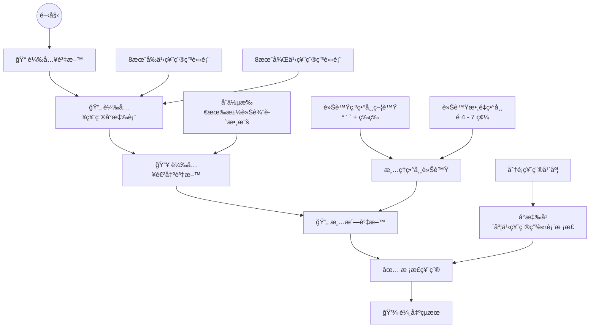

```mermaid
flowchart TD
        A@{ shape: circle, label: "開始" } --> B[📠載入資料]
        B --> C[📄 載入票種å°æ‡‰è¡¨]
        C --> D[📥 載入進出資料]
        D --> E[🔄 清洗資料]
        E --> F[✅ 校正票種]
        F --> G[💾 輸出çµæœ]

        B_Start1[ 8月å‰ä¹‹ç¥¨ç¨®ç”³è«‹è¡¨ ]
        B_Start2[ 8月後之票種申請表 ]
        B_Start1 --> C
        B_Start2 --> C

        D_Start1[ åˆä½µæ‰€æœ‰æ±½è»Šè¾¨è­˜æ•¸æ“š ]
        D_Start1 --> D

        E_Detail1[ 清ç†ç•°å¸¸è»Šè™Ÿ ]
        E_Detail1-1[ 車號為異常符號<br/> * ' ` + 等等 ]
        E_Detail1-2[ 車號數é‡ç•°å¸¸<br/>é 4 - 7 碼 ]

        E_Detail1-1 --> E_Detail1
        E_Detail1-2 --> E_Detail1
        E_Detail1 --> E

        F_Detail1[ 分é¡ç¥¨ç¨®å¹´åº¦ ]
        F_Detail2[ å°æ‡‰å¹´åº¦ä¹‹ç¥¨ç¨®ç”³è«‹è¡¨æ ¡æ­£ ]
        F_Detail1 --> F_Detail2 --> F

```