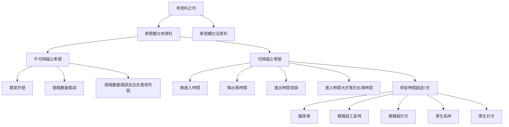
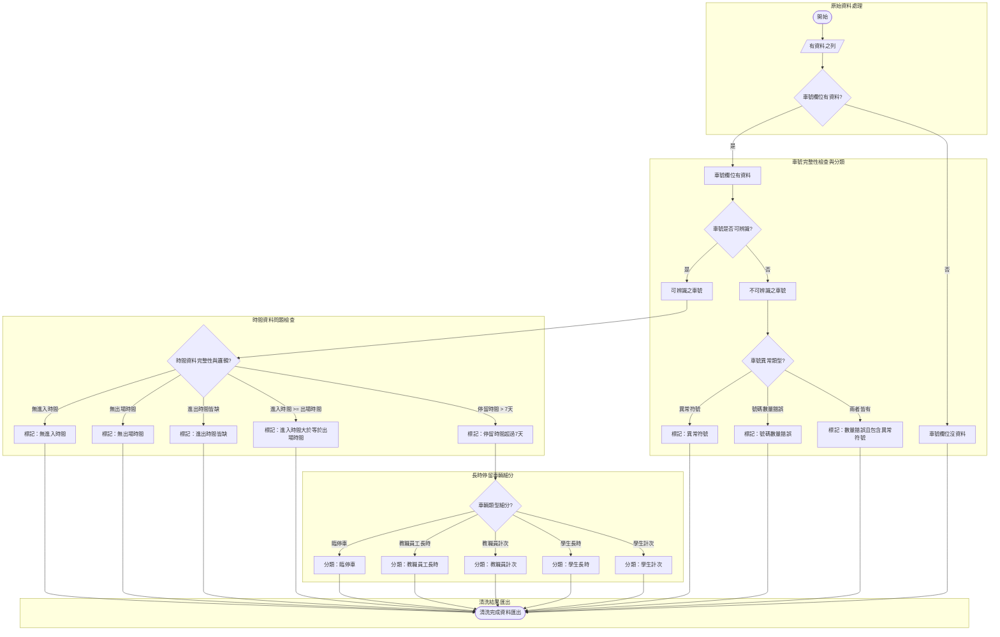

## 窮舉可能之原因

1. 欄位空值
   1. 進入時間
   2. 出場時間
   3. 兩缺
2. 時間異常
   1. 出場時間 早於 進入時間
   2. 出場時間 等於 進入時間
3. 車號異常
   1. 非 4 - 7 碼
   2. 空值
   3. 異常符號

## 資料呈現

|類別|數量|
|--|--|
|無車號資料數量|1174457|
|有車號資料數量|77138|

#
|有車號資料類別|數量|
|--|--|
|有車號可以做分類的數量|70461|
|車號不能做分類的數量|6677|
|魔幻進出時間的數量|38|
|僅缺『全時間格式進入時間』的資料筆數|0|
|僅缺『全時間格式出場時間』的資料筆數|42653|
|『全缺』兩者皆無的資料筆數|6677|
|停留時間超過7天的資料筆數|8975|
#
| 序號 | 票種               | 筆數 |
|------|--------------------|------|
| 0    | 臨停車             | 6162 |
| 1    | 教職員汽車         | 1269 |
| 2    | 學生長時汽車       | 983  |
| 3    | 學生計次汽車       | 278  |
| 4    | 長時廠商汽車       | 170  |
| 5    | 臨時貴賓           | 76   |
| 6    | 在職專班汽車       | 10   |
| 7    | 互惠車輛           | 10   |
| 8    | 特殊入校車輛       | 7    |
| 9    | 教職員計次         | 5    |
| 10   | 退休及校友汽車識別證 | 4    |
| 11   | 身障優惠           | 1    |

## 分類法: 先分票種
