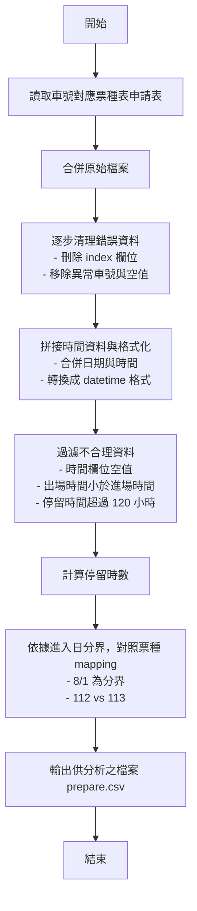

```mermaid
flowchart TD

A[開始]
B[讀取車號對應票種表申請表]
C[合併原始檔案]
D[逐步清理錯誤資料<br/>- 刪除 index 欄位<br/>- 移除異常車號與空值]
E[拼接時間資料與格式化<br/>- 合併日期與時間<br/>- 轉換成 datetime 格式]
F[過濾不合理資料<br/>- 時間欄位空值<br/>- 出場時間小於進場時間<br/>- 停留時間超過 120 小時]
G[計算停留時數]
H[依據進入日分界，對照票種 mapping<br/>- 8/1 為分界<br/>- 112 vs 113]
I[輸出供分析之檔案 prepare.csv]
J[結束]

A --> B --> C --> D --> E --> F --> G --> H --> I --> J


```