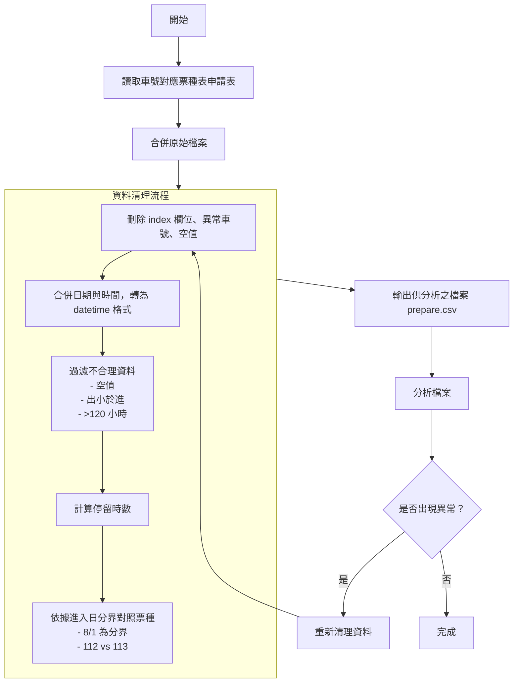

```mermaid
flowchart TD

A[開始]
B[讀取車號對應票種表申請表]
C[合併原始檔案]
P[資料清理處理流程]
I[輸出供分析之檔案 prepare.csv]
J[分析檔案]
K{是否出現異常？}
R[重新清理資料]
L[完成]

A --> B --> C --> P

subgraph P [資料清理流程]
    direction TB
    D[刪除 index 欄位、異常車號、空值]
    E[合併日期與時間，轉為 datetime 格式]
    F[過濾不合理資料<br/>- 空值<br/>- 出小於進<br/>- >120 小時]
    G[計算停留時數]
    H[依據進入日分界對照票種<br/>- 8/1 為分界<br/>- 112 vs 113]

    D --> E --> F --> G --> H
end

P --> I --> J --> K
K -- 是 --> R --> D
K -- 否 --> L

```

