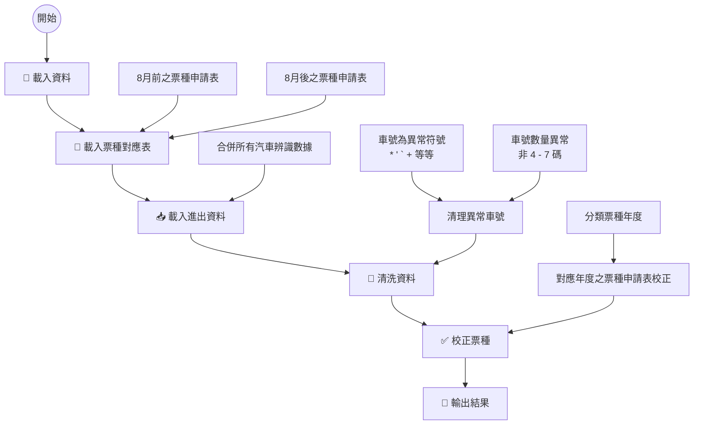

```mermaid
flowchart TD
        A@{ shape: circle, label: "開始" } --> B[📁 載入資料]
        B --> C[📄 載入票種對應表]
        C --> D[📥 載入進出資料]
        D --> E[🔄 清洗資料]
        E --> F[✅ 校正票種]
        F --> G[💾 輸出結果]

        B_Start1[ 8月前之票種申請表 ]
        B_Start2[ 8月後之票種申請表 ]
        B_Start1 --> C
        B_Start2 --> C

        D_Start1[ 合併所有汽車辨識數據 ]
        D_Start1 --> D

        E_Detail1[ 清理異常車號 ]
        E_Detail1-1[ 車號為異常符號<br/> * ' ` + 等等 ]
        E_Detail1-2[ 車號數量異常<br/>非 4 - 7 碼 ]

        E_Detail1-1 --> E_Detail1
        E_Detail1-2 --> E_Detail1
        E_Detail1 --> E

        F_Detail1[ 分類票種年度 ]
        F_Detail2[ 對應年度之票種申請表校正 ]
        F_Detail1 --> F_Detail2 --> F

```