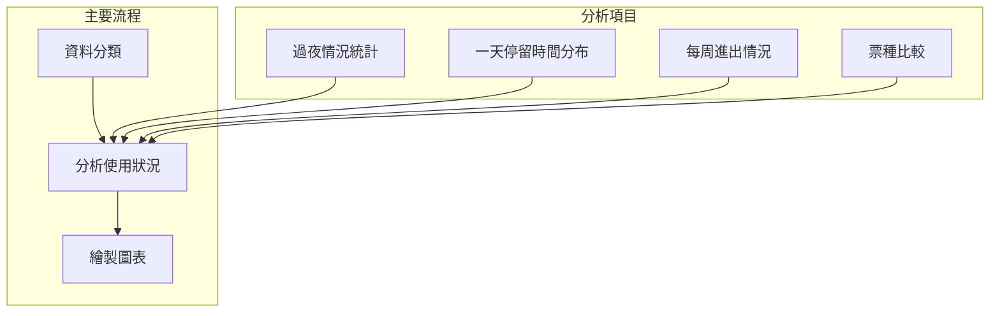

# code - 1
```python
tag = data["票種"].unique()
```
1. 先將票種分出來。也就是下面這樣:

```

```

```python 
overnight_mask = (data["出場日期"] > data["進場日期"]) & (data["全時間格式出場時間"].dt.time > time(8, 0))
data["是否過夜"] = overnight_mask

# 統計結果儲存用
result_summary = []

for each_cat in tag:
    temp_df = data[data["票種"] == each_cat]
    ticket_directory[each_cat] = temp_df
    if temp_df.empty:
        continue
    overnight_df = temp_df[temp_df["是否過夜"]]
    total_records = len(temp_df)
    overnight_count = len(overnight_df)
    overnight_ratio = overnight_count / total_records * 100
    overnight_per_day = overnight_df.groupby("進場日期").size().mean()
    avg_user_overnight = overnight_df["車號"].nunique() / temp_df["進場日期"].nunique()

    result_summary.append({
        "票種": each_cat,
        "工作日紀錄數": total_records,
        "過夜紀錄數": overnight_count,
        "過夜比例(%)": overnight_ratio,
        "每日過夜車次平均": overnight_per_day,
        "平均每日過夜用戶數": avg_user_overnight
    })
```

1. 定義過夜為"非當日出場，且出場時間為早上 8 點之後"。
2. 因為要記錄各自之平均，以 total_record 和 overnight_count 紀錄該票種之相對應資料數量。
3. ```overnight_per_day = overnight_df.groupby("進場日期").size().mean()```之說明如下:


- 假設資料為:

|車號	|進場日期	|票種	|是否過夜|
|--|--|--|--|
|ABC-1234|	2024-04-01	|教職員	|True|
|DEF-5678	|2024-04-01	|教職員	|True|
|GHI-9012|	2024-04-02	|教職員	|True|
|JKL-3456|	2024-04-02	|教職員	|True|
|MNO-7890	|2024-04-02|	教職員	|True|

**則執行 ```overnight_df.groupby("進場日期").size()```結果是**

```
進場日期
2024-04-01    2
2024-04-02    3
dtype: int64
```

** 再套上```mean()```就會變成 (2 + 3) / 2**

```
2.5
```
4. ```avg_user_overnight = overnight_df["車號"].nunique() / temp_df["進場日期"].nunique()```之說明如下:

- 假設資料為

|車號|	是否過夜|
|--|--|
|ABC-1234|	True|
|ABC-1234	|True|
|DEF-5678	|True|
|DEF-5678	|True|
|GHI-9012	|True|
|GHI-9012	|True|

**則 ```overnight_df["進場日期"].nunique()```會回傳 3**，也就是"有幾個"不重複物件。

- ```avg_user_overnight``` = 「總共有幾個過夜的獨立車號」 ÷ 「所有有紀錄的日期數量」
- 也就是**平均每天有幾台不同的車會留下來過夜**


# code - 2

```python
df["start_floor"] = df["全時間格式進入時間"].dt.floor("30min")
df["leave_floor"] = (df["全時間格式出場時間"] + pd.Timedelta(minutes=29)).dt.floor("30min") # 未滿 30 就進位

# 建立每筆資料的所有停留時間格
def generate_time_blocks(row):
    return pd.date_range(start=row["start_floor"], end=row["leave_floor"] - pd.Timedelta(minutes=1), freq="30min")

tqdm.pandas(desc="建立所有停留時間格（支援跨日）")
df["time_blocks"] = df.progress_apply(generate_time_blocks, axis=1)

```
1. 新增```start_floor```和```leave_floor```兩個欄位記錄進出場的底半小時。
2. 10:17 → 10:00、 13:04 + 29min = 13:33 → 13:30。
3. ```generate_time_blocks(row)``` 用來對每一筆 row 產生他的占用時間格，```pd.date_range(start=..., end=..., freq="30min")```。
- 例如:

```
start = 10:00
end = 13:29
→ 結果：['10:00', '10:30', '11:00', '11:30', '12:00', '12:30', '13:00']
每一格代表這台車"占用該時段的停車位"
```
4. ```df.progress_apply(generate_time_blocks,axis = 1)``` 表示**對 ```df``` 中的每一筆資料（每一列 row）都套用 ```generate_time_blocks()``` 函數
並加上一個 ```tqdm``` 的進度條顯示**。產出如下```time_blocks```欄位:

|車號	|進場時間	|出場時間	|time_blocks|
|--|--|--|--|
|ABC-1234	|10:17	|13:04	|['10:00', '10:30', ..., '13:00']|
|DEF-5678	|21:55	|01:15+1d	|['22:00', '22:30', ..., '01:00']|

```python
# 展開為每半小時一筆資料
exploded = df.explode("time_blocks")
exploded["時間標籤"] = exploded["time_blocks"].dt.strftime("%H:%M")


# 統計每個票種在每個時間格的總數
pivot_table = exploded.groupby(["時間標籤", "票種"]).size().unstack(fill_value=0)

# 確保順序一致
bin_labels = [t.strftime("%H:%M") for t in pd.date_range("00:00", "23:30", freq="30min")]
pivot_table = pivot_table.reindex(bin_labels)

# 除以天數，取得每日平均
avg_table = pivot_table / len(data["出場日期"].unique())

# 匯出
avg_table.to_excel(output_graph_file + "每日平均停留_含跨日_半小時統計.xlsx")
```

1. ```explode("time_block")```把該欄位從一個 list 中每個元素拿出來變成一筆。舉例:

|車號|	time_blocks|
|--|--|
|ABC-1234|	[10:00, 10:30, 11:00]|

explode 後變成

|車號	|time_blocks|
|--|--|
|ABC-1234|	10:00|
|ABC-1234|	10:30|
|ABC-1234|	11:00|

2. ```strftime("%H:%M")```把時間格式化，```%H``` 表示24小時制小時數（0-23），```%M```則是分鐘數(0-59)。
3. ```exploded.groupby(["時間標籤", "票種"])``` 按照半小時區間和票種群集。
4. ```.size()```去計算當下那組有幾筆資料，也就是該半小時區間內有多少車。
5. ```.untrack()```將票種從列換成行，如下範例:
   
|時間標籤	|臨停車	|學生計次汽車	|教職員汽車	|...|
|--|--|--|--|--|
|08:00	|132	|56	|44	|...|
|08:30	|143	|51	|40	|...|
|...	|...	|...	|...	|...|

6. ```[t.strftime("%H:%M") for t in pd.date_range("00:00", "23:30", freq="30min")]``` 創建完整時間索引，從 00:00 到 23:30 。
7. ```reindex(bin_labels)```就是強制把該 dataframe 的索引排成跟他相同樣子。
8. ```avg_table = pivot_table / len(data["出場日期"].unique())```
    - pivot_table 是所有累計的車輛佔用數量。
    - ```len(data["出場日期"].unique()``` 為有紀錄的總天數。
    - 得到平均每一天的佔用情況
    - 也就是 **某時段** **平均每天有幾台教職員車在停**

# code - 3

```python
# 新增欄位：進出時間的星期幾（0=週一, ..., 6=週日）
data["進場星期"] = data["全時間格式進入時間"].dt.dayofweek
data["出場星期"] = data["全時間格式出場時間"].dt.dayofweek
# 各星期幾的進出次數統計
entry_by_weekday = data["進場星期"].value_counts().sort_index()
exit_by_weekday = data["出場星期"].value_counts().sort_index()

# 對應中文星期名
weekday_labels = ["週一", "週二", "週三", "週四", "週五", "週六", "週日"]

plt.figure(figsize=(10, 5))
plt.plot(weekday_labels, entry_by_weekday.values, label="進場", marker='o')
plt.plot(weekday_labels, exit_by_weekday.values, label="出場", marker='s')
plt.title("每週進出場次分析")
plt.xlabel("星期")
plt.ylabel("車輛數")
plt.legend()
plt.grid(True, alpha=0.3)
plt.tight_layout()
plt.savefig(output_graph_file + "每週進出場次.png", dpi=300)
plt.close()
```

# code - 4

```python
# 加入停留時間欄位
data["停留時數"] = (data["全時間格式出場時間"] - data["全時間格式進入時間"]).dt.total_seconds() / 3600

# 計算每票種平均停留時間
avg_stay_by_ticket = data.groupby("票種")["停留時數"].mean().sort_values(ascending=False)
# 標記短停與長停
data["停留分類"] = pd.cut(data["停留時數"], bins=[0, 1, 8, 100],
                         labels=["短停(<=1h)", "中停(1~8h)", "長停(>8h)"])

# 計算票種與停留分類的交叉表
cross_tab = pd.crosstab(data["票種"], data["停留分類"], normalize='index') * 100
```

1. ```avg_stay_by_ticket = data.groupby("票種")["停留時數"].mean().sort_values(ascending=False)```

- 假設資料是:

|車號|	票種|	停留時數|
|--|--|--|
|ABC-1234|	臨停車|	1.2|
|DEF-5678|	教職員汽車|	6.5|
|GHI-9999|	臨停車|	2.1|
|JKL-0000|	教職員汽車|	7.2|

- 則 ```groupby("票種")["停留時數"]``` 會回傳類似的結構:

```
"臨停車" → [1.2, 2.1]  
"教職員汽車" → [6.5, 7.2]
```
- 再接個```.mean()``` 就會回傳這個 dataframe :
  
|票種	|平均停留時數|
|--|--|
|教職員汽車	|6.85|
|臨停車	|1.65|

2. ```pd.cut()``` 三個參數 -> 你要分類的數值序列, 分類邊界（bins）, 每段的標籤
```python
data["停留分類"] = pd.cut(
    data["停留時數"],                   # 要分類的欄位
    bins=[0, 1, 8, 100],               # 分段的邊界
    labels=["短停(<=1h)", "中停(1~8h)", "長停(>8h)"]  # 每段的名稱
)
```

- ```labels``` 為這幾段區間命名。
- ```pd.cut()``` 把這結果放進該資料 ```"停留分類"``` 欄位中。
- 舉例資料長這樣:

|停留時數|
|--|
|0.5|
|1.0|
|1.5|
|7.9|
|9.0|
|12.5|

- 使用 ```pd.cut(...)``` 之後：

|停留時數	|停留分類|
|--|--|
|0.5	|短停(<=1h)|
|1.0	|短停(<=1h)|
|1.5	|中停(1~8h)|
|7.9	|中停(1~8h)|
|9.0	|長停(>8h)|
|12.5	|長停(>8h)|

3. ```crosstab(data["票種"], data["停留分類"])``` 索引放票種，欄位放所有停留分類，填入該票種該分類之資料數量。

- 舉例產出:

|票種	|短停(<=1h)	|中停(1~8h)	|長停(>8h)|
|--|--|--|--|
|臨停車	|1000	|200	|10|
|教職員汽車	|200	|1500	|400|
|學生長時汽車	|50	|600	|850|

- 而 ```normalize = "index"``` 指的是將每一列的加總為 1 ，將其內部轉成小數。
- 所以乘上 100 就會變成百分比。
